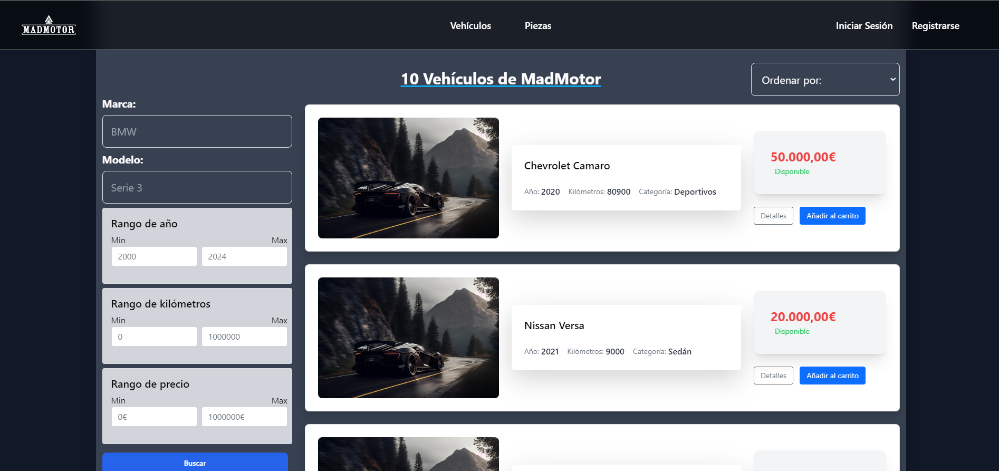
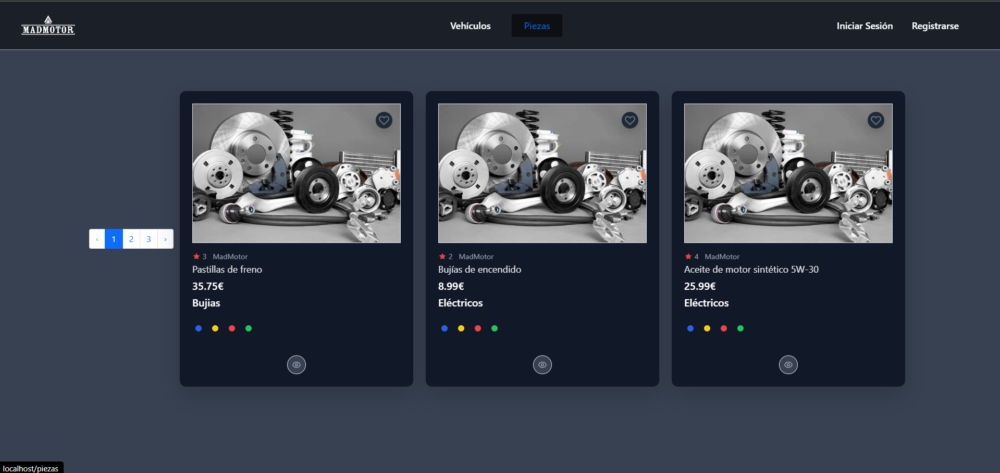
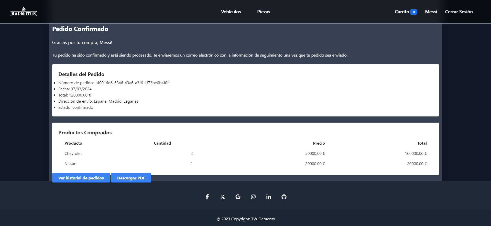
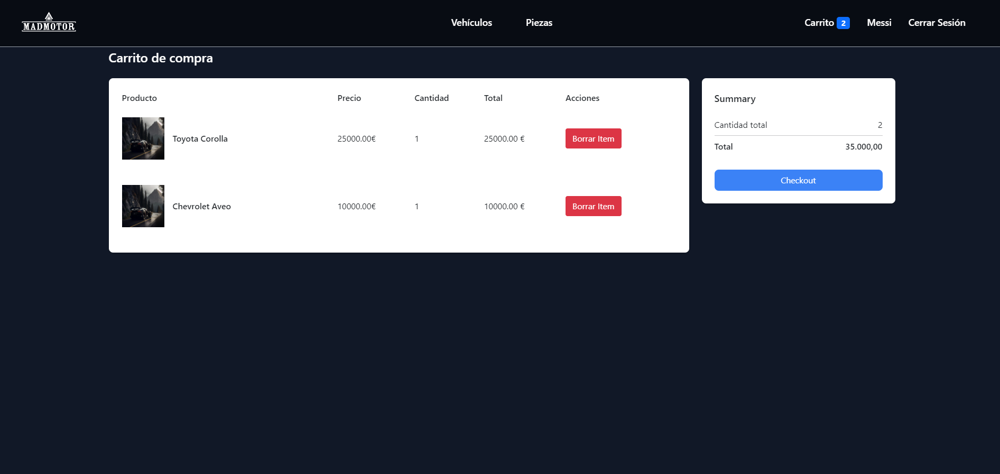

# Proyecto aplicación web Concesionario de Vehículos con Laravel

¡Bienvenido al proyecto de Web para un concesionario de vehículos desarrollado por el equipo **MadMotorDAW**!

## Índice

1. [Autores](#autores)
2. [Descripción](#descripción)
3. [Estructura del Proyecto](#estructura-del-proyecto)
4. [Bases de datos utilizadas](#bases-de-datos-utilizadas)
5. [Test](#test)
6. [Dependencias utilizadas en producción](#dependencias-utilizadas-en-producción)
7. [Tecnologias usadas](#tecnologias-usadas)
8. [Algunas vistas](#algunas-vistas)
9. [Contribución](#contribución)
10. [Contacto](#contacto)
11. [Agradecimientos](#agradecimientos)

---

## Autores
Este proyecto fue desarrollado por [Mohamed El Kasmi](https://github.com/Mohaek10), [Ruben Fernandez](https://github.com/rubenprzz), [Joe Brandon](https://github.com/JBrandonCL), [Luis Ramos](https://github.com/LuisRamosRobles) y [Miguel Vicario](https://github.com/miviru).
Alumnos de 2º DAW del IES Luis Vives, Proyecto de la asignatura **Desarrollo Web en entornos Servidor**

## Descripción 
Este proyecto consiste en una WEB desarrollada con Laravel para un concesionario de automóviles. La WEB proporciona funcionalidades para gestionar: 
--vehículos, piezas, categorías, pedidos, personal, clientes, autenticación de usuarios y almacenamiento de ficheros, carritos

## Estructura del Proyecto

El proyecto sigue la siguiente estructura de carpetas:

# Estructura del Proyecto

    Http
    │   ├── Controllers
    │   │   ├── Auth
    │   │   │   ├── ConfirmPasswordController.php
    │   │   │   ├── ForgotPasswordController.php
    │   │   │   ├── LoginController.php
    │   │   │   ├── RegisterController.php
    │   │   │   ├── ResetPasswordController.php
    │   │   │   └── VerificationController.php
    │   │   ├── CarritoController.php
    │   │   ├── CategoriaController.php
    │   │   ├── ClientesController.php
    │   │   ├── Controller.php
    │   │   ├── HomeController.php
    │   │   ├── PedidoController.php
    │   │   ├── Personal
    │   │   │   └── PersonalAuthController.php
    │   │   ├── PersonalController.php
    │   │   ├── PiezaController.php
    │   │   └── VehiculoController.php
    │   ├── Kernel.php
    │   └── Middleware
    │       ├── Authenticate.php
    │       ├── CheckRole.php
    │       ├── EncryptCookies.php
    │       ├── PreventRequestsDuringMaintenance.php
    │       ├── RedirectIfAuthenticated.php
    │       ├── TrimStrings.php
    │       ├── TrustHosts.php
    │       ├── TrustProxies.php
    │       ├── ValidateSignature.php
    │       └── VerifyCsrfToken.php
    ├── Models
    │   ├── Categoria.php
    │   ├── Clientes.php
    │   ├── LineaDePedido.php
    │   ├── Pedido.php
    │   ├── Personal.php
    │   ├── Pieza.php
    │   ├── User.php
    │   └── Vehiculo.php
    ├── Policies
    │   ├── ClientePolicy.php
    │   └── PedidoPolicy.php
    └── Providers
        ├── AppServiceProvider.php
        ├── AuthServiceProvider.php
        ├── BroadcastServiceProvider.php
        ├── EventServiceProvider.php
        └── RouteServiceProvider.php

## Bases de datos utilizadas

- **PostgreSQL**: Utilizado para almacenar datos estructurados y relacionales relacionados con la aplicación y gestionar los pedidos.
  
## Carrito 

- **Sistema de carrito** : El carrito se gestiiona mediante las sessiones, que gracias a laravel se hace muy sencillo

## Test
En la carpeta **test/feature** se almacenan los test de los controladores.

## Dependencias utilizadas en producción
        "php": "^8.1",
        "barryvdh/laravel-dompdf": "^2.0",
        "guzzlehttp/guzzle": "^7.2",
        "laravel/framework": "^10.10",
        "laravel/sanctum": "^3.3",
        "laravel/tinker": "^2.8",
        "laravel/ui": "^4.5"

## Tecnologias usadas

- Boostrap: Para el diseño de la web, implementado atraves de CDN del boostrap
- Tailwind: Diseño de la web y nos ha ahorrado tener que usar estilos de CSS en un fichero externo
- Dompdf: Genera el archivo pdf através de una vista con blade
- Docker: Como tecnología para hacer todo el build de la web
- Sail: Facilita la creación del proyecto de laravel, importando la base de datos de postgre 

## Algunas vistas

### Pagina principal

### Pagina de vehiculos

### Pagina de piezas

### Pagina de pedidos

### Pagina de carrito

### Contribución

Las contribuciones son bienvenidas. Si deseas contribuir al proyecto, por favor sigue estas instrucciones:

1. Haz un fork del repositorio.
2. Crea una rama nueva (`git checkout -b feature/nueva-funcionalidad`).
3. Haz tus cambios y commitéalos (`git commit -am 'Añadir nueva funcionalidad'`).
4. Sube tus cambios a la rama (`git push origin feature/nueva-funcionalidad`).
5. Abre una pull request.

## Contacto
mohamed.elkasmi@alumno.iesluisvives.org
miguel.vicario@alumno.iesluisvives.org
luis.ramos@alumno.iesluisvives.org
ruben.fernandez@alumno.iesluisvives.org
joe.brandon@alumno.iesluisvives.org
## Agracedimientos
¡Gracias por visitar nuestro proyecto hecho con Laravel para un concesionario de vehículos! Esperamos que encuentres útil y completo este README para comprender la estructura, funcionalidades y documentación de nuestra WEB.

Si tienes alguna pregunta, sugerencia o deseas contribuir al proyecto, no dudes en contactarnos o seguir las instrucciones detalladas en la sección de contribución. ¡Estamos ansiosos por recibir tus aportes y mejorar juntos este proyecto!

¡Que tengas un excelente día y mucha suerte en tus proyectos! 🚀🔧✨

